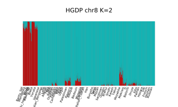
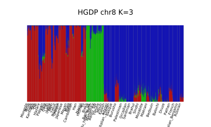
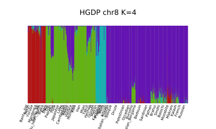

# fastStructure

[fastStructure](https://rajanil.github.io/fastStructure/#:~:text=fastStructure%20is%20an%20algorithm%20for,x.) is an algorithm for inferring population structure from large SNP genotype data. It is based on a variational Bayesian framework for posterior inference and is written in Python2.x. It can use input files in `plink` format (bed, bim and fam files for the dataset should all be present in the same path).

<center>


_Frigure from: [Raj, Anil, Matthew Stephens, and Jonathan K. Pritchard. "fastSTRUCTURE: variational inference of population structure in large SNP data sets." Genetics 197.2 (2014): 573-589.](https://academic.oup.com/genetics/article/197/2/573/6074271)_
</center>

***********************************************************************************

### Pruning

Before running fastStructure, it is advised to prune the dataset. We will use `plink` to prune the dataset by excluding the SNPs which are in [Linkage](https://en.wikipedia.org/wiki/Linkage_disequilibrium). The resulting file will have fewer SNPs, and the computation will be faster. For these exercises, we will subset the data to contain only SNPs from chromosome 8 (`--chr 8`) so we can finish the demonstration quickly. In reality, you would most probably like to run fastStructure on all autosomes (`--autosome`) rather than just on one chromosome.

<br />To prune for LD we will use these settings previously recommended for HO array 
<br />`--indep-pairwise 200 25 0.4`:
<br />window size in SNPs = 200;
<br />number of SNPs to shift the window at each step = 25;
<br />r^2 threshold (pairwise SNP-SNP metric) = 0.4;

<br />Using these parameters specified above we will 
<br />a) consider a window of 200 SNPs,
<br />b) calculate LD between each pair of SNPs in the window,
<br />b) remove one of a pair of SNPs if the LD is greater than 0.4,
<br />c) shift the window 25 SNPs forward and repeat the procedure.


``` bash
plink1.9 --bfile hgdp_newFIDs_modernPops_MindGeno --indep-pairwise 200 25 0.4 --out prune_hgdp
plink1.9 --bfile hgdp_newFIDs_modernPops_MindGeno --extract prune_hgdp.prune.in --recode12 --make-bed --chr 8 --out hgdp_pruned_chr8
```

!!! question
    How many SNPs are left after pruning?

***********************************************************************************

### Running fastStructure

The main script you will need to execute is `structure.py`. If you would like to run it on your own computer you could install it following the [instructions](https://rajanil.github.io/fastStructure/#:~:text=fastStructure%20is%20an%20algorithm%20for,x.). I already installed in on `evop-login` server and in next few steps you will prepare folders and make a soft link to directory with python scripts used by fastStructure.

``` bash
cd ~/popgen_intro
mkdir fastStructure
cd fastSructure
mkdir out
ln -s /home/bajiv90/bin_bajiv90/fastStructure-master fs
```

To see command-line options that need to be passed to the script, you can do the following:
``` bash
$ python fs/structure.py

Here is how you can use this script

Usage: python structure.py
     -K <int>   (number of populations)
     --input=<file>   (/path/to/input/file)
     --output=<file>   (/path/to/output/file)
     --tol=<float>   (convergence criterion; default: 10e-6)
     --prior={simple,logistic}   (choice of prior; default: simple)
     --cv=<int>   (number of test sets for cross-validation, 0 implies no CV step; default: 0)
     --format={bed,str} (format of input file; default: bed)
     --full   (to output all variational parameters; optional)
     --seed=<int>   (manually specify seed for random number generator; optional)
```

***********************************************************************************

The key options to pass to the scripts are the __input file__, __the output file__ and __the number of populations__. 

Assuming the input file is named `hgdp_pruned_chr8.bed` (with corresponding `hgdp_pruned_chr8.fam` and `hgdp_pruned_chr8.bim`), the output file is named `hgdp_pruned_chr8_output` and the number of populations you would like is `2`, you can run the algorithm as follows:

``` bash
python fs/structure.py -K 2 --input=../plink_exercise/hgdp_pruned_chr8 --output=out/hgdp_pruned_chr8

```
!!! note
    The input file names should **not** include suffixes (e.g., `.bed`) and are relative to the main project directory (unless a full path is provided).

This generates a `hgdp_pruned_chr8.2.log` file that tracks how the algorithm proceeds, and files `hgdp_pruned_chr8.2.meanQ` and `hgdp_pruned_chr8.2.meanP` containing the posterior mean of admixture proportions and allele frequencies, respectively. The orders of samples and SNPs in the output files match those in the `.fam` file and `.bim` file, respectively. 


!!! task
    Create a for loop that will execute fastStructure for K values from 2 to 9.
    
    ??? task "Click for answer"
        ```
        for k in 6 7 8 9 
        do
        python fs/structure.py -K $k --input=../plink_exercise/hgdp_pruned_chr8 --output=out/hgdp_pruned_chr8
        done
        ```

***********************************************************************************

### Choosing model complexity

In order to identify the best value of K ( i.e. to choose the appropriate number of model components) that explain structure in the dataset, it is recommend to run the algorithm for multiple choices of K. Creators of fastStructure have provided a utility tool to parse through the output of these runs and provide a reasonable range of values for the model complexity appropriate for a dataset of interest.

Assuming that the algorithm was run on the test dataset for choices of K ranging from 2 to 4, and the output flag was `--output=out/hgdp_pruned_chr8`, you can obtain the model complexity by doing the following:

``` bash
$ python fs/chooseK.py --input=out/hgdp_pruned_chr8
Model complexity that maximizes marginal likelihood = 4
Model components used to explain structure in data = 2
```

***********************************************************************************

### Visualizing admixture proportions

!!! note
    If you would like to visualize results stored at evop-login you have to ssh with `-X` option.

In order to visualize the expected admixture proportions inferred by fastStructure, creators of fastStructure have provided a simple tool to generate [Distruct](https://web.stanford.edu/group/rosenberglab/distruct.html) plots using the mean of the variational posterior distribution over admixture proportions. The samples in the plot will be grouped according to population labels inferred by fastStructure. However, if the user would like to group the samples according to some other categorical label (e.g., geographic location), these labels can be provided as a separate file using the flag `--popfile`. The order of labels in this file (one label per row) should match the order of samples in the input data files.

``` bash
$ python fs/distruct.py

Here is how you can use this script

Usage: python distruct.py
     -K <int>  (number of populations)
     --input=<file>  (/path/to/input/file; same as output flag passed to structure.py)
     --output=<file>   (/path/to/output/file)
     --popfile=<file>  (file with known categorical labels; optional)
     --title=<figure title>  (a title for the figure; optional)
```

Assuming the algorithm was run on the `hgdp_pruned_chr8` dataset for K=2, and the output flag was `--output=out/hgdp_pruned_chr8`, you can generate a Distruct plot by doing the following:

``` bash
python fs/distruct.py -K 2 --input=out/hgdp_pruned_chr8 --output=out/hgdp_pruned_chr8_K2.svg
```

Assuming that we logged in to `evop-login` with `ssh -X` we can open the `.svg` file like this:
```
display out/hgdp_pruned_chr8.svg
```  

Alternatively, you can download the file to your local computer and ispect it there.


We would still like to change the default population labels. To do so we can provide distruct with `--popfile` in which we specify population labels for each individual. You can find this information in `.fam` file in which I added in first column infomation about population for each individual. 

!!! note "Task"
    a) Extract first column from `.fam` file and save it in separate file.<br />
    b) Make a new plot using labels from newly created file.

    ??? note "Hints"
        a) Try doing it with `awk` or `cut`<br />
        b) Use `--popfile` option in `distruct.py`

    ??? note "Click for answers"
        a) Extract first column from `.fam` file and save it in separate file.
        ``` bash
        cd ~/popgen_intro/fastStructure

        # To extract first column with cut and save it in new file
        cut -f1 -d" " ../plink_exercise/hgdp_4_fastStructure.fam > pop_labels.txt

        # To extract first column with awk and save it in new file
        awk '{print $1}' ../plink_exercise/hgdp_4_fastStructure.fam > pop_labels.txt
        ```

        b) Make a new plot using labels from newly created file.
        ``` bash
        python fs/distruct.py -K 2 --input=out/hgdp_pruned_chr8 --popfile=pop_labels.txt --title="HGDP chr8 K=2" --output=out/hgdp_pruned_chr8_K2_pop_labels.svg
        ```


??? note "Click to see plots"
    
     


     


     


!!! tip
    Plotting `fastStructure` results with `distruct` can be tricky when many K's and runs are present. One can use [PONG](https://github.com/ramachandran-lab/pong) to visualize multiple runs and Ks from fastStructure or ADMIXTURE. PONG takes care of the colors across different Ks and order of individuals and populations for us. It's great and I highly recommend it. :) 